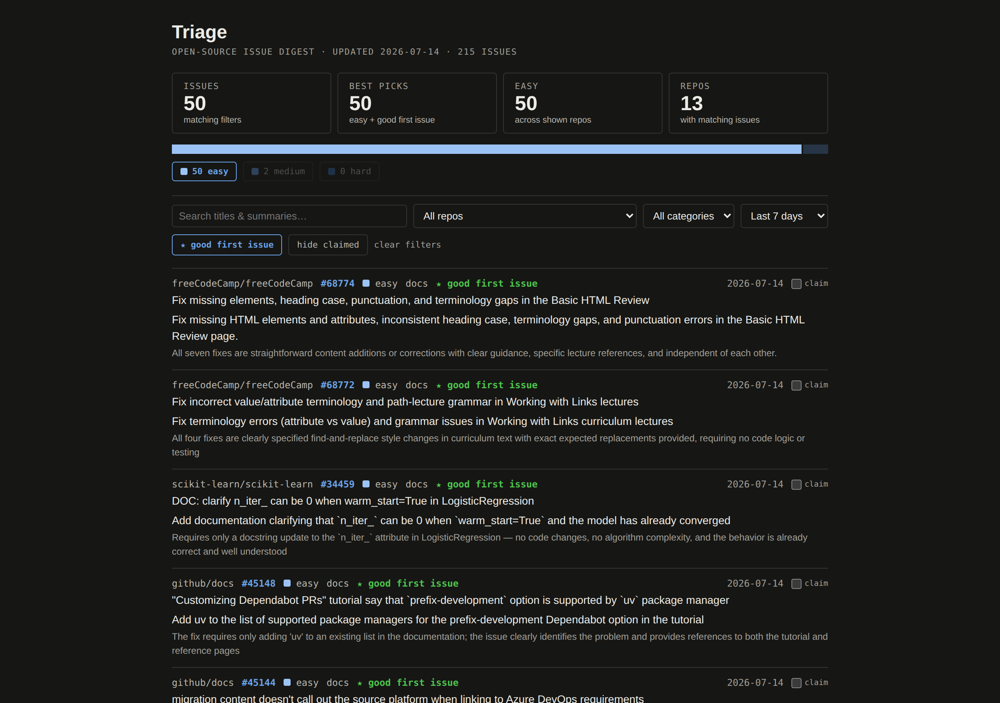
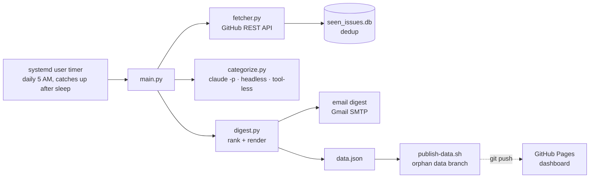

# Triage Agent

[](https://github.com/jesse-reed-dev/triage-agent/actions/workflows/tests.yml)

A daily agent that finds open-source issues worth contributing to. It scans ~20
active repos, has Claude rate every new issue for category, difficulty, and
good-first-issue fit, then delivers a ranked digest by email — and publishes
everything to a **[live dashboard](https://jesse-reed-dev.github.io/triage-agent/)**.



## What it does

Every morning at 5 AM, unattended:

1. **Fetches** new open issues from a curated watchlist ([src/repos.py](src/repos.py)) via the GitHub REST API
2. **Dedupes** against every issue already delivered (SQLite)
3. **Rates** each new issue with Claude — category (`bug/feature/docs/test/refactor`),
   difficulty (`easy/medium/hard`), good-first-issue fit, a one-line summary, and
   why it's easy or hard to pick up
4. **Ranks** them easiest-first (best picks → easy → medium → hard) and emails an
   HTML digest via Gmail SMTP
5. **Publishes** the cumulative record to a `data` branch that feeds the
   [GitHub Pages dashboard](https://jesse-reed-dev.github.io/triage-agent/) —
   filterable by repo, difficulty, category, and date, with local claim-tracking

## Architecture



## How categorization works

Each new issue is one headless call to the Claude Code CLI
(`claude -p … --output-format json`), running on a Claude subscription — **no
API key anywhere in the system**. The issue body is untrusted internet content,
so the call is sandboxed: `--tools ""` strips every built-in tool and
`--disallowedTools "mcp__*"` blocks MCP, making it pure text-in/text-out — a
malicious issue body has nothing to hijack. Responses are validated against a
fixed vocabulary (unknown category or difficulty ⇒ the issue is delivered
unrated rather than trusted). The prompt lives in
[src/categorize.py](src/categorize.py).

## Design decisions worth reading

- **Delivery-gated dedup.** An issue is marked "seen" only after the digest
  containing it is successfully delivered (email-send success, or the report
  write when email isn't configured). A run that crashes, times out, or fails
  to send consumes nothing — the same issues are retried next run. The whole
  pipeline is effectively transactional: deliver, or retry tomorrow.
- **Subscription, not API key.** Categorization shells out to the local Claude
  CLI under the user's existing login. Nothing to provision, no separate
  billing, no secret to leak — and the reason the scheduler is local instead
  of a cloud runner.
- **Prompt-injection sandboxing.** The model that reads untrusted issue text
  has no tools, and its output passes strict validation before anything
  downstream touches it. The dashboard and email escape all issue-derived text.
- **Local-first, git-published.** The pipeline runs on your machine (systemd
  timer with `Persistent=true` — a run missed while asleep fires on wake).
  The only thing that leaves is `data.json`, committed to an orphan `data`
  branch by git plumbing and pushed with a write-scoped deploy key — the
  narrowest credential that can update the dashboard. `main` never sees a
  bot commit.
- **SQLite for state, JSON for the product.** One machine owns the dedup file,
  which is SQLite's home game; the dashboard reads a plain JSON record that
  doubles as the pipeline's history.

## Run your own

Prerequisites: Linux with systemd (macOS users: swap the timer for a launchd
plist or cron entry), Python 3.12+, the
[Claude Code CLI](https://code.claude.com) installed and logged in
(subscription required).

```bash
git clone https://github.com/jesse-reed-dev/triage-agent ~/projects/triage-agent
cd ~/projects/triage-agent
python3 -m venv .venv && .venv/bin/pip install -r requirements.txt
```

Create `.env` at the repo root:

```
GITHUB_TOKEN=your_github_token          # required — issue fetching
GMAIL_ADDRESS=you@gmail.com             # optional — email delivery
GMAIL_APP_PASSWORD=your_app_password    # optional — Gmail app password, not your real one
DIGEST_TO=someone@example.com           # optional — defaults to GMAIL_ADDRESS
```

Without the Gmail variables the digest is still written to
`data/digest-YYYY-MM-DD.md` — the file write counts as delivery.
(`GMAIL_APP_PASSWORD` is an [app password](https://myaccount.google.com/apppasswords);
it requires 2FA.)

Then:

```bash
.venv/bin/python src/main.py     # one manual run to verify
./deploy/install.sh              # schedule it daily at 5 AM
```

Edit [src/repos.py](src/repos.py) to change the watchlist. Forking this repo?
Your clone starts with a fresh slate automatically — the dedup DB and data.json
are local files, never committed to `main`.

To publish your own dashboard: enable GitHub Pages on `main` `/docs`, update
the two URLs at the top of `docs/index.html`, and give the pipeline push
access to the `data` branch with a repo-scoped deploy key:

```bash
ssh-keygen -t ed25519 -f ~/.ssh/triage_agent_deploy -N "" -C "triage-agent-data-publish"
printf '\nHost triage-agent-push\n  HostName github.com\n  User git\n  IdentityFile ~/.ssh/triage_agent_deploy\n  IdentitiesOnly yes\n' >> ~/.ssh/config
ssh-keyscan -t ed25519 github.com >> ~/.ssh/known_hosts
git remote add data-publish triage-agent-push:YOUR_USER/YOUR_FORK.git
```

Add `~/.ssh/triage_agent_deploy.pub` under repo **Settings → Deploy keys**
with **write access**. Without the remote, runs still commit locally and you
push the `data` branch by hand.

## The Claude Code skill

The repo ships a project skill: open Claude Code here and run `/triage`. Claude
runs the pipeline and presents the digest — and the skill encodes the
operational knowledge (dedup semantics, run cadence, failure modes), so edge
cases are handled without re-explaining each session.

## Tech stack

- Python (stdlib + `requests`) · GitHub REST API
- Claude Code CLI headless mode (`claude -p`, claude-haiku-4-5) on subscription
- SQLite dedup · JSON data record · pytest (47 tests, CI on every PR)
- systemd user timer · Gmail SMTP · GitHub Pages (vanilla JS, no build step)
